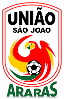

# **União São João Futebol Clube** - Site (Projeto Pessoal)

[Visite o site](https://uniaosaojoaoweb.vercel.app/)

Este projeto é um **site front-end** desenvolvido como uma **homenagem pessoal** ao **União São João Futebol Clube**, um time de futebol da cidade de **Araras-SP**. O clube, fundado em 1991, não possuía um site oficial, então o objetivo deste projeto foi criar uma plataforma onde torcedores e simpatizantes possam acessar informações, notícias e acompanhar as novidades do time.

**Nota**: Este projeto não tem vínculo oficial com o União São João Futebol Clube. É uma iniciativa pessoal de um torcedor do clube.

---

## 🏆 História do Clube

O **União São João Futebol Clube** foi fundado em **1991** e é um dos times mais queridos da cidade de Araras-SP. Com uma trajetória de altos e baixos, o clube sempre manteve sua base de torcedores fiel, sendo uma referência para a cidade. O time participou de diversas competições, incluindo o Campeonato Paulista e outras competições estaduais, e é um símbolo de união e paixão pelo futebol na cidade.

---

## 🚀 Funcionalidades

- **Design Responsivo**: O site foi construído com **HTML**, **CSS** e **Bootstrap** para garantir que funcione bem em qualquer dispositivo.
- **Homenagem ao Clube**: O site foi criado para dar visibilidade ao time e ajudar a comunidade a se conectar com o clube.

---

## 🛠 Tecnologias Utilizadas

- **HTML**: Para estruturar o conteúdo da página.
- **CSS**: Para definir o estilo e o design visual.
- **Bootstrap**: Framework para criar um layout responsivo e moderno.

---

## 📸 Imagens do Projeto

### Logo do Time


[Visite o site](https://uniaosaojoaoweb.vercel.app/)

Este projeto é um **site front-end** desenvolvido como uma **homenagem pessoal** ao **União São João Futebol Clube**, um time de futebol da cidade de **Araras-SP**. O clube, fundado em 1991, não possuía um site oficial, então o objetivo deste projeto foi criar uma plataforma onde torcedores e simpatizantes possam acessar informações, notícias e acompanhar as novidades do time.

**Nota**: Este projeto não tem vínculo oficial com o União São João Futebol Clube. É uma iniciativa pessoal de um torcedor do clube.

---

## 🏆 História do Clube

O **União São João Futebol Clube** foi fundado em **1991** e é um dos times mais queridos da cidade de Araras-SP. Com uma trajetória de altos e baixos, o clube sempre manteve sua base de torcedores fiel, sendo uma referência para a cidade. O time participou de diversas competições, incluindo o Campeonato Paulista e outras competições estaduais, e é um símbolo de união e paixão pelo futebol na cidade.

---

## 🚀 Funcionalidades

- **Design Responsivo**: O site foi construído com **HTML**, **CSS** e **Bootstrap** para garantir que funcione bem em qualquer dispositivo.
- **Homenagem ao Clube**: O site foi criado para dar visibilidade ao time e ajudar a comunidade a se conectar com o clube.

---

## 🛠 Tecnologias Utilizadas

- **HTML**: Para estruturar o conteúdo da página.
- **CSS**: Para definir o estilo e o design visual.
- **Bootstrap**: Framework para criar um layout responsivo e moderno.

---

## 📸 Imagens do Projeto

### Logo do Time



### Screenshots da Página


---


---


---


---


---

## 📅 Como Rodar o Projeto Localmente

1. Clone o repositório:

   ```bash
   git clone https://github.com/seuusuario/uniaosaojoaoweb.git
)

---

## 🎯 Próximos Passos

Este projeto serve como uma homenagem ao União São João e tem planos de evoluir. O objetivo é implementar um backend para incluir funcionalidades dinâmicas, como notícias, resultados de jogos e informações sobre partidas futuras, tornando o site ainda mais interativo para os torcedores.

---

## 📅 Licença

Este projeto não está vinculado oficialmente ao União São João Futebol Clube. É uma criação pessoal e não tem nenhum vínculo com o clube.
